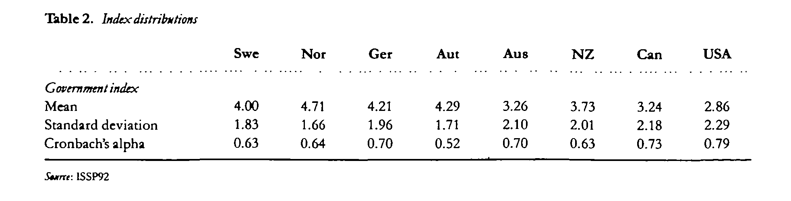

$~$
$~$

#### **Nate Breznau, Lisa Heukamp & Hung H.V. Nguyen**
#### **University of Bremen**

_____________________________________________________________________________

$~$
$~$

### Description

In 1997, Stefan Svallfors (1997) published, “Worlds of Welfare and Attitudes to Redistribution: A Comparison of Eight Western Nations” in which he analyzed data from the 1992 ‘Social Inequality Module’ of the International Social Survey Program (ISSP). He wanted to understand how attitudes are structured in various welfare regimes. For twenty years, his study has been a standard citation in scholarship on comparative welfare states and social policy preferences. The ISSP was the first macro-comparative survey of policy preferences, and Svallfors’ work was one of the first to compare attitudes toward redistribution in as many as eight countries using these data. In this paper we revisit his path-breaking work in light of theories of policy preferences. We replicate his work, we further investigate his measurement and distributional assumptions about attitudes toward redistribtuion, and we then expand his original work.

We use the ISSP 1992 'Social Inequality' data provided by GESIS. File "[ZA.2310.dta](https://www.gesis.org/issp/modules/issp-modules-by-topic/social-inequality/1992)".

**His original study used three questions:** 

1. It is the responsibility of the government to reduce the differences between people with high incomes and those with low incomes? --> v57

2. The government should provide a job for everyone who wants one? --> v59

3. The government should provide everyone with a guaranteed basic income? --> v62

**He constructed a "government index" scale from the three questions as follows:** 

*“For this purpose, an additive index was constructed from the three items, dividing between 'strongly agree' and 'agree' (2); 'neither agree nor disagree' (1); and ‘disagree' and 'strongly disagree' (0). These items were summed, creating an index which may vary between 0 and 6, where 0 means disagreeing with all three propositions and thereby endorsing a clear-cut anti-interventionist stand and 6 means a strong interventionist standpoint“* (Svallfors 1997: 289). 


**He used eight country cases:** 

Swe, Nor, Ger, Aut, Aus, Nz, Can, USA
Theese are in v3 coded as Swe=10,Nor=9,GermanyW=2,Aut=6,Aus=1,NZ=16,Can=17,US=5

#######################
#2-points to follow up on
#on the GESIS archive there appears to be older versions of the data, we should try this version to see if we get an exact replication of Svallfors
#the codebook states that respondents could select "Don't know/can't choose" and it should have been coded "8", but there is no such code here. We should email GESIS and ask about this.
#######################

```{r, include = F}
rm(list = ls())
```


```{r setup, include=FALSE}

library(pacman)

pacman::p_load("dplyr","tidyverse","knitr","haven","car","plyr","data.table","expss","htmlTable","magrittr","ltm","questionr","survey","remotes","stargazer","lavaan","ltm", "tidylog", "kableExtra","lm.beta","MplusAutomation")

#remotes::install_github("DiogoFerrari/occupar")
library(occupar)


#wd <- "S:/Für meine Gruppen/Public Opinion and Social Policy/Hung's/OpPol/Data/ISSP/Social Inequality/"

wd <- "C:/data/"

# We don't want to see messages in the final document
knitr::opts_chunk$set(message = F)

```


```{r readdata, include=FALSE}
# Here we import the data. 

socIn92 <- read_dta(paste(wd,"ZA2310.dta",sep=""))


```

__________________________________________________________________________________

## PART ONE: Replication of Svallfors (1997)

### Dataset Prep

We imported the original dataset (SocIn92) and then generate a recoded dataset (SocIn92recode). We create new variables (dplyr:mutate) by recoding (car::recode) the above mentioned variables following Svallfors workflow.

```{r, echo = T}
socIn92recode <- socIn92 %>%  
  dplyr::mutate(
    r1= car::recode(socIn92$v57,recodes = '1:2=2; 3=1; 4:5=0'),
    r2= car::recode(socIn92$v59,recodes = '1:2=2; 3=1; 4:5=0'),
    r3= car::recode(socIn92$v62,recodes = '1:2=2; 3=1; 4:5=0'),
      
# Here we create Svallfors additive index "govermental index". Cases with at least one NA value are automatically excluded. 

     govIndex = r1+ r2+ r3,   

# to measure the percentage of people agreeing (answer category 1 and 2). Needed for table 1.     
 
    r1p= car::recode(socIn92$v57,recodes = '1:2=100; 3:5=0'), 
    r2p= car::recode(socIn92$v59,recodes = '1:2=100; 3:5=0'),
    r3p= car::recode(socIn92$v62,recodes = '1:2=100; 3:5=0')
  )%>%
  
# Now we reduce our dataset to the countries Svallfors includes in his analysis (dyplr:filter).
  
   dplyr::filter(
     v3 %in% c(2,5,17,6,1,16,9,10)  
     )

 # We remove all cases with NA values in the variables (complete.cases)

socIn92recode<-socIn92recode[complete.cases(socIn92recode$r1p),]
socIn92recode<-socIn92recode[complete.cases(socIn92recode$r2p),]
socIn92recode<-socIn92recode[complete.cases(socIn92recode$r3p),]
```

### A Reproduction of "Table 1" from Svallfors (1997, p. 288)

### The original Table 1


Now that we have prepared our variables, we construct **Table 1: Attitudes to redistribution in eight nations**:


```{r Table1, echo = T, incldue = T}

# First, we creat vectors with the country means of our variables r1p, r2p, r3p (tapply).

govinc<-tapply(socIn92recode$r1p,socIn92recode$v3,mean) 
govjobs<-tapply(socIn92recode$r2p,socIn92recode$v3,mean)
govbas<-tapply(socIn92recode$r3p,socIn92recode$v3,mean)

# We make a table in form of a dataframe with the just created vectors (rbind) and sort the columns of the table following Svallfors.

table1<-as.data.frame(rbind(govinc,govjobs,govbas))
table1<-table1[,c(6,5,2,4,1,7,8,3)]   

# We create a vector with the country names in the same order (->cnt) and a vector with the questions belonging to the variables (-> item.table1). The first is used as column names, the latter as row names. 

cnt<-c("Swe","Nor","Ger","Aut","Aus","NZ","Can","USA") 
item.table1<-c("It is the responsibility of the government to reduce the differences between people with high incomes and those with low incomes?","The government should provide a job for everyone who wants one?","The government should provide everyone with a guaranteed basic income?")

row.names(table1)<-item.table1
colnames(table1) = cnt
#Finally, we creat a HTML table (knitr:kable).

t1 <- knitr::kable(table1,format="html", digits = round(1), caption = "Table 1. \"Table 1\" in Svallfors (1997): Attitudes to redistribution in eight nations. Percentage agreeing with certain propositions")

# extraKabel to better column spacing

column_spec(t1, 2:9, "4em")

```

### Reproductions of Table 2 (Svallfors 1997, p. 289). 

### The Original Table 2



OUr first reproduction is a weighted version of Svallfors' Table 1

This table uses the dplyr::mutate function to obtain weighted means using the ISSP provided weights, we should check these at some point - are the provided for each country? are they plausible?.

```{r, echo = T, incldue = T}


socIn92recode<-socIn92recode %>%
  group_by(v3)%>% 
  dplyr::mutate(
    wmean_r1p = weighted.mean(r1p,v176),
    wmean_r2p = weighted.mean(r2p,v176),
    wmean_r3p = weighted.mean(r3p,v176))

govinc_w<-tapply(socIn92recode$wmean_r1p,socIn92recode$v3,mean) 
govjobs_w<-tapply(socIn92recode$wmean_r2p,socIn92recode$v3,mean)
govbas_w<-tapply(socIn92recode$wmean_r3p,socIn92recode$v3,mean)  

table1_w<-as.data.frame(rbind(govinc_w,govjobs_w,govbas_w))
table1_w<-table1_w[,c(6,5,2,4,1,7,8,3)]  

row.names(table1_w)<-item.table1
colnames(table1_w) = cnt

t2 <- knitr::kable(table1_w,format="html", digits = round(1), caption = "Table 2. Weighted Version of Table 1")

column_spec(t2, 2:9, "4em")
```


```{r, include = F}
### Table 1. Weights, alternative method

#This version uses sapply with a function to generate weighted means. Might be useful if we need to produce many tables.

#Hung's way for table 1 with weights
table1.2 <- round(as.data.frame(sapply(list(10,9,2,6,1,16,17,5), function(x) {
  d <<- socIn92recode[which(socIn92recode$v3 == x),]
  sapply(list(d$r1p,d$r2p,d$r3p), function(y) weighted.mean(y,d$v176)
  )})),2)
colnames(table1.2) <- c("Swe","Nor","Ger","Aut","Aus","NZ","Can","USA")

```

### Table 3. Replication of Svallfors "Table 2"

Here we replicate **Tabel 2: Index distribution**  in the same way we constructed Table 1. 

```{r measurement1, echo=T, incldue = T}

#mean and standard deviation 
govIndexmean<-tapply(socIn92recode$govIndex,socIn92recode$v3,mean)
govIndexsd<-tapply(socIn92recode$govIndex,socIn92recode$v3,sd)

#cronbach's alpha by country (here for the recoded variable r1,r2,r3 = 394:396!)
a <- list(1,2,5,6,9,10,16,17)
cronalpha <- round(unlist(as.data.frame(sapply(a, function(x) {
  c <-socIn92recode[which(socIn92recode$v3 == x),c(394:396)]
  cronbach.alpha(c)
}))[1,]),2)
table2[3,] <- cronalpha

table2<-as.data.frame(rbind(govIndexmean,govIndexsd,cronalpha))
table2<-table2[,c(6,5,2,4,1,7,8,3)]

item.table2<-c("Mean","Standard Deviation", "Cronbach's alpha")
row.names(table2)<- item.table2
colnames(table2)<- cnt 


t3 <- knitr::kable(table2,format="html", digits = round(2), caption = "Table 3. Government Index Descriptives and Alpha (replication of \"Table 2\" in Svallfors (1997)")

column_spec(t3, 2:9, "4em")

```
### Table 4. Descrepancies in our results

From the start of this project we noticed small differences in the descriptive statistics between the original Svallfors study and ours. We suspect this is due to our usage of the GESIS 1992 ISSP data versus Svallfors' 1992 data file which was not cleaned, standardized and archived. **We plan to contact Svallfors when our work is closer to completion to ask about these descrepancies.**

Table 4 demonstrates the differences between our results and Svallfors' results. Panel A has unweighted and Panel B weighted differences in means.

```{r compareT1, echo = T, incldue = T}
#Now we want to compare our results for table 1 with the results of Svallfors 

#Here we create a copy of table 1 with the original values of Svallfors

table1Sval<-data.frame(matrix(c(53.7,74.1,45.5,60.0,78.3,78.4,65.5,66.3, 58.1,69.5,72.1,51.2, 42.6, 39.4, 50.9, 53.1, 49.1, 60.5, 47.9, 40.1, 48.6, 38.3, 47.1, 34.2),nrow = 3,ncol = 8))
row.names(table1Sval)<-item.table1
colnames(table1Sval) = cnt

#The deviations of our replicated table and the original table in Svallfors' article.
table1diff <- round(table1 - table1Sval,2)

#Here our weighted table versus his original table.
table1diff_w <- round(table1_w - table1Sval,2)
```


```{r compareT1hide, eval = F}
# Code to produce the two tables

t4a <- knitr::kable(table1diff, format="html", digits = round(3), caption = "Panel A. Unweighted Discrepancies")

column_spec(t4a, 2:9, "4em")

t4b <- knitr::kable(table1diff_w, format="html", digits = round(3), caption = "Panel B. Weighted Discrepancies")

column_spec(t4b, 2:9, "4em")

```

Table 4. Descrepancies in Author Results versus Svallfors' (1997) Original.
```{r compareT4, echo = F}
t4a <- knitr::kable(table1diff, format="html", digits = round(3), caption = "Panel A. Unweighted Discrepancies")

column_spec(t4a, 2:9, "4em")

t4b <- knitr::kable(table1diff_w, format="html", digits = round(3), caption = "Panel B. Weighted Discrepancies")

column_spec(t4b, 2:9, "4em")
```

### Class Scheme Coding

We attempt to replicate the Erikson, Goldthorpe and Portracrero [1979](https://www.jstor.org/stable/589632) Class Scheme. From Svallfors' article he claims to followtheir coding scheme. We follow the EGP to the best of our ability by recoding various occupational codes provided by the countries in 1992; in other words, not all provided ISCO back then. Our resulting EGP scheme follows but does not exactly replicate Svallfors' results. We are unsure if this is a result of the data being slight different (see Tables 1-4) or if Svallfors' class coding scheme was different.

Svallfors provides his original SPSS coding to construct his class schemes. **We will replicate this coding at some point.**
```{r EGP, include = T, echo = T}
#here we replicate the class scheme

#we thought we could get the scheme from the cumulative ISSP 

socIncum <- read_dta(paste(wd, "ZA5890_v1-0-0.dta", sep = ""))
socIn92new <- socIncum[which(socIncum$V5 %in% c(752, 578, 276, 40, 36, 554, 124, 840) & socIncum$V4 == 1992),] 
socIn92new <- socIn92new[,c("V3","ISCO88")]

#but there are no ISCO88 codes for 1992 so we are stuck with the Swedish coding
#It uses NYK 'Nordic Occupational Classification System

socIn92new <- dplyr::rename(socIn92new, v2 = V3)

newdata <- as.data.frame(left_join(socIn92recode, socIn92new, by = "v2"))

newdata$v110 <- car::recode(newdata$v110, recodes = '2=0')

#Here is the NYK scheme for Sweden (variable s106)
#It appears that Svallfors' original data was SEI classification (2-digit), but that provided in the ISSP from GESIS is NYK83
#we use Erik Bihagen's translation of NYK into ISCO88 [although they are not perfectly transferrable!!] http://www.camsis.stir.ac.uk/occunits/SwedishNYK8590majgpsv1.sps

newdata$isco88se <- car::recode(newdata$s106, recodes = "
1 = 2141; 2 = 2143; 3 = 2144; 4 = 2145; 5 = 3116; 6 = 3117; 7 = 2142; 8 = 2148; 9 = 3119; 12 = 3211; 13 = 3211; 14 = 2114; 15 = 2112; 16 = 2113; 19 = 3111; 21 = 2211; 22 = 3213; 23 = 3213; 29 = 2211; 30 = 1210; 31 = 2310; 32 = 2320; 33 = 2331; 34 = 2320; 35 = 2359; 36 = 2320; 37 = 2352; 39 = 2359; 41 = 2460; 49 = 3480; 51 = 2421; 52 = 2429; 53 = 2429; 
54 = 2429; 59 = 2429; 61 = 2451; 62 = 1234; 63 = 1229; 69 = 2451; 71 = 2452; 72 = 3471; 73 = 3471; 74 = 3131; 75 = 3474; 76 = 2453; 77 = 2455; 79 = 2455; 91 = 2432; 92 = 2431; 99 = 2446; 101 = 2221; 102 = 2230; 103 = 3231; 104 = 3232; 105 = 3133; 106 = 5132; 107 = 5132; 109 = 9132; 111 = 3226; 112 = 2229; 119 = 3226; 121 = 2222; 122 = 3225; 123 = 3225; 129 = 3225; 131 = 2224; 139 = 3228; 141 = 2223; 149 = 3227; 151 = 2446; 152 = 1228; 153 = 5131; 154 = 5133; 155 = 1228; 159 = 2446; 161 = 3152; 162 = 3151; 169 = 3152; 191 = 2445; 192 = 3223; 199 = 3460; 201 = 1110; 202 = 3443; 203 = 3444; 209 = 1110; 211 = 2419; 212 = 3431; 219 = 2419; 221 = 2412; 222 = 3423; 229 = 2412; 231 = 2411; 232 = 2411; 239 = 4121; 241 = 4115; 242 = 4111; 249 = 4190; 251 = 2131; 252 = 3122; 259 = 3121; 261 = 2441; 262 = 2122; 269 = 2441; 291 = 4190; 292 = 4122; 293 = 3412; 294 = 3412; 295 = 4221; 296 = 3422; 297 = 1317; 299 = 4190; 311 = 3471; 312 = 3413; 313 = 3419; 319 = 3419; 321 = 3416; 331 = 1314; 332 = 5220; 333 = 5220; 339 = 5220; 399 = 5220; 400 = 1311; 401 = 6112; 402 = 6130; 403 = 6130; 404 = 6130; 405 = 6130; 406 = 6129; 409 = 6112; 411 = 6112; 412 = 6121; 413 = 6112; 414 = 6129; 419 = 6121; 421 = 6154; 431 = 6152; 432 = 6151; 439 = 6152; 441 = 6141; 449 = 6141; 501 = 7111; 509 = 7111; 511 = 8113; 521 = 8121; 531 = 8155; 599 = 7111; 601 = 3142; 602 = 3142; 603 = 3141; 609 = 3142; 611 = 8340; 612 = 8340; 619 = 8340; 621 = 3143; 629 = 3143; 631 = 8311; 640 = 8322; 641 = 8324; 642 = 8322; 643 = 9151; 649 = 8334; 651 = 3144; 652 = 5112; 653 = 5111; 659 = 5112; 661 = 4133; 662 = 3144; 663 = 8312; 664 = 4133; 669 = 4133; 671 = 4142; 673 = 3132; 674 = 3132; 675 = 3132; 679 = 4142; 681 = 4142; 682 = 9151; 689 = 4142; 691 = 4133; 699 = 9330; 701 = 8261; 702 = 7332; 703 = 7432; 705 = 8262; 706 = 7435; 707 = 3152; 709 = 7332; 711 = 7433; 712 = 7434; 713 = 7433; 714 = 7437; 715 = 7435; 716 = 7433; 719 = 7436; 721 = 7442; 722 = 7442; 723 = 8268; 729 = 8269; 731 = 8121; 732 = 8122; 733 = 8122; 735 = 7215; 736 = 7221; 737 = 7211; 739 = 8122; 741 = 7311; 742 = 7311; 743 = 3224; 744 = 3211; 745 = 7313; 746 = 7323; 749 = 7222; 751 = 8211; 752 = 7233; 753 = 7231; 754 = 7213; 755 = 7136; 756 = 7212; 757 = 7214; 758 = 8223; 759 = 7214; 761 = 7241; 762 = 7241; 763 = 8282; 764 = 7244; 765 = 7245; 766 = 3131; 769 = 8282; 771 = 6141; 772 = 8141; 773 = 8240; 775 = 7331; 776 = 7331; 777 = 7423; 779 = 8141; 781 = 7141; 782 = 7132; 783 = 7141; 789 = 7139; 791 = 7122; 793 = 7123; 794 = 7124; 795 = 7134; 796 = 7135; 799 = 7129; 801 = 7341; 802 = 7343; 803 = 8251; 804 = 7345; 805 = 8224; 809 = 8251; 811 = 7322; 812 = 7321; 813 = 8131; 814 = 7323; 819 = 8139; 821 = 8273; 822 = 7412; 823 = 8274; 824 = 8278; 825 = 9320; 826 = 7411; 827 = 8272; 828 = 8279; 829 = 8278; 831 = 8159; 832 = 8151; 833 = 8151; 834 = 8231; 835 = 8232; 839 = 8159; 841 = 8142; 842 = 8143; 843 = 8253; 849 = 8142; 851 = 7129; 852 = 8265; 853 = 7312; 854 = 7113; 859 = 7222; 861 = 8161; 869 = 8161; 871 = 8333; 872 = 8332; 873 = 8334; 879 = 9330; 881 = 9320; 882 = 9330; 889 = 9320; 891 = 9151; 901 = 5161; 902 = 9162; 903 = 5162; 904 = 3441; 905 = 5163; 906 = 5169; 909 = 5169; 911 = 1225; 912 = 5122; 913 = 5123; 914 = 5123; 915 = 4222; 916 = 5111; 919 = 5123; 921 = 5121; 929 = 5121; 931 = 9141; 932 = 9131; 939 = 9141; 941 = 5141; 942 = 5149; 949 = 5141; 951 = 9133; 952 = 9133; 959 = 9133; 961 = 3475; 971 = 5143; 979 = 5149; 981 = 110; 989 = 110")

#now merge the imputed SE ISCO 
newdata$ISCO88 <- ifelse(newdata$v3==10,newdata$isco88se,newdata$ISCO88)

newdata$egp <- occupar::isco88toEGP(newdata$ISCO88, self.employed = newdata$v110, n.employees = newdata$v108)

newdata <- newdata %>%
  mutate(
    egp6 = car::recode(egp, recodes = '"I     Service class I" = "Service I";"II    Service class II" = "Service II"; "III.a Routine non-manual, higher grade" = "Routine"; "III.b Routine non-manual, lower grade" = "Routine"; "IV.a  Self-employed with employees" = "Self"; "IV.b  Self-employed with no empoyees" = "Self"; "IV.c  Self-employed Farmers etc" = "Self"; "V     Manual supervisors/Lower grade technicians" = "Skilled";"VI    Skilled workers" = "Skilled"; "VII.a Unskilled workers" = "Unskilled"; "VII.b Farm labours" = "Unskilled"')
  ) #V Manual supervisors = Skilled in Svallfors' coding. It's another decision he made.
```

### Table 5. Distribution of Government Index by EGP Class and Country

```{r EGP2, include = T, echo = T}
tableA2 <- round(as.data.frame(sapply(list(10,9,2,6,1,16,17,5), function(x) {
  d <<- newdata[which(newdata$v3 == x),]
  tapply(d$govIndex,d$egp6, mean)
  })),2)
colnames(tableA2) <- c("Swe","Nor","Ger","Aut","Aus","NZ","Can","USA")
t5 <- knitr::kable(tableA2,format="html", digits = round(2), caption = "Distribution of \'Government Index\' by EGP Class and Country. Part of Svallfors\' \"Table A2\"")

column_spec(t5, 2:9, "4em")
```

### Attempt to Reproduce Results. The differences are sometimes worrysome. 

```{r}

newdata$female<-car::recode(newdata$v99, recodes = '1=0; 2=1')
newdata$empl<-car::recode(newdata$v104, recodes = '1:3=0; 5=1; c(4,6,8,9,10)=3; 7=2')

newdata$unskilled<-car::recode(newdata$egp6, recodes = '"Service I"=4; "Service II"=3; "Routine"=2; "Self"=5; "Skilled"=1;"Unskilled"=0')

m1nor<- lm(govIndex~female+factor(unskilled)+factor(empl),data = newdata, subset = (v3 %in% c(9)))

m1ger<- lm(govIndex~female+factor(unskilled)+factor(empl),data = newdata, subset = (v3 %in% c(2)))

m1aus<- lm(govIndex~female+factor(unskilled)+factor(empl),data = newdata, subset = (v3 %in% c(1)))

m1usa<- lm(govIndex~female+factor(unskilled)+factor(empl),data = newdata, subset = (v3 %in% c(5)))


table4<- stargazer(m1nor, m1ger, m1aus, m1usa, title= "Table 4",type = "text", single.row = TRUE, report = "vc*", star.cutoffs = c(0.05,0.01,0.001), covariate.labels = c("Female", "Skilled", "Routine non-manual", "Service class II", "Service class I", "Self-employed", "Unemployed", "Retired", "Others not in labor force"), column.labels = c("Norway", "Germany", "Australia", "USA"))

#to make it a file

table4 %>% paste(., collapse="\n") %>% cat("\n")

newdata2<- subset(newdata,v3==5)

gmean<-tapply(newdata2$govIndex,newdata2$egp,mean)
gsd<-tapply(newdata2$govIndex,newdata2$egp,sd)
table6<-as.data.frame(rbind(gmean,gsd))

knitr::kable(table6,format="html", digits = round(2), caption = "Exploring the Standard Deviations to Understand Discrepancies")
```


_______________________________________________________________________________________

## PART TWO: Questioning Svallfors Construct of "Redistributive Attitudes" 

Classic attitude theory suggests that agree/disagree (or 'Likert' type response questions) tend to be normally distributed around some mean. In fact, latent varaible measurment of attitudes also tends toward this assumption. Svallfors forces the three ISSP questions into somewhat dichotomous distributions by collapsing the two agree categories and the two disagree categories. 

We turn this into an empirical question by comparing the Svallfors' distribution versus a more 'classical' attitudes distribution.

NOTE: it appears that Andress and Heien used the same three ISSP 1992 questions for their study. The treated their scale as continuous and normally distributed. We should mention this in our paper.

After working with lavaan for some time it became clear that there are too many limitations. lavaan cannot do an efficient exploratory factor analysis, handle dichotomous latent variable outcomes (i.e. 'latent class analysis'), and is limited in its multi-group modelling. Therefore, we need to use Mplus to fully investigate Svallfors' scale.

### Table X. The Distribution of Svallfors' Scale (Additive, thus assigning equal weight to each of the three variables)

Distribution is not normal.

```{r govindex dist}
ggplot(socIn92recode, aes(govIndex)) +
  geom_bar(fill = "black") + 
  ggtitle("Svallfors Collapsed Categories as Additive Index")
hist(socIn92recode$r1, 3)

```

### Table A. Correlations

In this chunk we create an export .dat file for Mplus, in addition to looking at the correlations between the attitude variables and a few criterion variables.

```{r measurement2, echo = T, include = T}
# Correlation commands are easier when the data.frame has only the variables of interest.

socIn92cor <- as.data.frame(dplyr::select(socIn92recode, v57, v59, v62, r1, r2, r3, v3, v99, v100, v102, s103, cdn103))

# Make 'agree' = higher values
socIn92cor <- socIn92cor %>% dplyr::mutate(
v57 = car::recode(socIn92cor$v57,recodes = '1=5; 2=4; 3=3; 4=2; 5=1'),
v59 = car::recode(socIn92cor$v59,recodes = '1=5; 2=4; 3=3; 4=2; 5=1'),
v62 = car::recode(socIn92cor$v62,recodes = '1=5; 2=4; 3=3; 4=2; 5=1'),
#Canada missing ed in years, impute, best guess (1=none, 2= grade school, 3= some high, 4=hs complete, 5=some college, 6= college complete, 7=university complete, 8=grad school)
cdn103 = car::recode(socIn92cor$cdn103,recodes = '1=4; 2=8; 3=10; 4=12; 5=14; 6=16; 7=17; 8=20'),
#Sweden impute (1=primary, 2=secondary(2 years), 3=secondary(3 years), 4= university) 
s103 = car::recode(socIn92cor$s103,recode = '1=8; 2=10; 3=12; 4=15'),
#Swe=10,Nor=9,GermanyW=2,Aut=6,Aus=1,NZ=16,Can=17,US=5
v3 = car::recode(socIn92cor$v3,recodes = '10=752; 9=578; 2=276; 1=36; 6=40; 16=554; 17=124; 5=840'))

socIn92cor$s103 <- ifelse(is.na(socIn92cor$s103), socIn92cor$cdn103, socIn92cor$s103)
socIn92cor$v102 <- ifelse(is.na(socIn92cor$v102), socIn92cor$s103, socIn92cor$v102)


socIn92cor <- as.data.frame(dplyr::select(socIn92cor, v57, v59, v62, r1, r2, r3, v3, v99, v100, v102))
socIn92cor <- drop_na(socIn92cor)

# output Mplus data (future iterations should include missing values)
# does not accept haven attributes, remove them by exporting to csv and reimporting
write.csv(socIn92cor, file = "svtemp.csv")
socinm <- as.data.frame(read.csv(file = "svtemp.csv"))
unlink("svtemp.csv")


prepareMplusData(socinm, filename = "svallfors.dat", inpfile = T)

cor <- cor(socIn92cor)
# This keeps only one side of the diagonal
cor[upper.tri(cor, diag=TRUE)] <- as.numeric("")

options(knitr.kable.NA = '')
t10 <- knitr::kable(cor,format="html", digits = round(2), col.names = c("IncD_5","Jobs_5","BasicI_5","IncD_3","Jobs_3","BasicI_3","Country","Male","Age","Ed_Years"), caption = "Table 10. Correlations of Original and Recoded ISSP Questions from Svallfors (1997)")

column_spec(t10, 2:10, "5em")
```

### Missing data

```{r missing}

```

### Note from Mplus results (and you can see this below in lavaan)
The basic three factor scale is "just identified", this means it has as many estimated parameters as observed parameters. This means there is no possibility to use the global chi-square fit test. We thus have to rely on indices (AIC, Log-likelihood) to compare models.

## Import results from Mplus

```{r fitimport}
lca2 <- readModels("C:/GitHub/Svallfors-1997-Replication/svallfors1lcac2.out", recursive = TRUE)
lca3 <- readModels("C:/GitHub/Svallfors-1997-Replication/svallfors1lcac3.out", recursive = TRUE)
lca4 <- readModels("C:/GitHub/Svallfors-1997-Replication/svallfors1lcac4.out", recursive = TRUE)
lca5 <- readModels("C:/GitHub/Svallfors-1997-Replication/svallfors1lcac5.out", recursive = TRUE)

```


The risk in collapsing response categories is that important information about the underlying attitude might be thrown away, and worse that this might introduce error that is non-random and produces artificial results. However, Svallfors' collapsed coding might still be empirically appropriate, if not somehow superior to using the data in its original format. We assume he had a logical basis for this methodological choice. We test this first by estimating an ordered probit model of each of the questions with their original responses. To support Svallfors decision we would expect that the cutpoints would show little distance between strongly agree and agree, and the same for strongly disagree and disagree. If found, we would have evidence that respondents who select either of the two responses do not systematically differ.

We have a second strategy for testing this and further testing the choice of combining these three particular items into a scale. ...would be different latent class analyses (LCA) using the question data in their original 5-category response format. To substantiate Svallfors' method we would expect that the LCAs do not show 

## Fit statistics from Mplus


### Measurement Models

Prep data for SEM, separate data.frames for each SEM seems to work best. Also, attributes must be removed for lavaan to operate properly.

```{r measurement3, echo = F, include = T}
# Remove missings to use ML estimator

socIn92recodeM <- dplyr::select(socIn92recode, v57, v59, v62, r1, r2, r3, v3)
socIn92recodeM <- as.data.frame(na.omit(socIn92recodeM))

# Remove attributes or some lavaan functions do not work
socIn92recodeM[] = c(socIn92recodeM, recursive=TRUE)

```


```{r measurement4, include = F}
# This assigns a factor structure to a latent variable "att_sval" using the three questions after they were recoded with Svallfors' 3-categories scheme. Agree / Neutral / Disagree.
m_sval <- 'att_sval =~ r1 + r2 + r3' 

# This factor structure is equivalent to Savllfors' "government index" scale. Each item's factor loading is fixed at 1. The 1 determines that each has equal weight in constructing the scale. Any additive index automatically assigns equal weight to every item in the scale, thus the two are perfectly correlated, but likely have different means.
m_sval1 <- 'att_sval1 =~ 1*r1 + 1*r2 + 1*r3' # 1* = fixed at 1

# This model uses the original 5-category coding of the three variables. Strongly agree / Agree / Neutral / Disagree / Strongly disagree
m_norm <- 'att_norm =~ v57 + v59 + v62'


# The 'cfa' command is known as a "confirmatory factor analysis". This simply means that we assign the factor structure to the model, rather than having the model do an "exploratory factor analysis" where it 'explores' different possible factor structures among the various combinations of variables.

fit_sval <- cfa(m_sval, data = socIn92recodeM)
fit_sval1 <- cfa(m_sval1, data = socIn92recodeM)
fit_norm <- cfa(m_norm, data = socIn92recodeM)

# Normally we look at standardized factor scores for comparison.

summary(fit_sval, fit.measures=TRUE)
inspect(fit_sval,what="std")$lambda

#This command merges the predicted factor scores into the original data

fs_sval <- lavPredict(fit_sval)
sval_idx <- lavInspect(fit_sval, "case.idx")
for (fs in colnames(fs_sval)) {
  socIn92recodeM[sval_idx, fs] <- fs_sval[ , fs]
}
```


```{r measurement5, include = F}
summary(fit_sval1, fit.measures=TRUE)
inspect(fit_sval1,what="std")$lambda
fs_sval1 <- lavPredict(fit_sval1)
sval1_idx <- lavInspect(fit_sval1, "case.idx")
for (fs in colnames(fs_sval1)) {
  socIn92recodeM[sval1_idx, fs] <- fs_sval1[ , fs]
}


```


```{r measurement6, include = F}
# Need to compare predicted fs to see if it is identical to Svallfors' additive scale


summary(fit_norm, fit.measures=TRUE)
inspect(fit_norm,what="std")$lambda
fs_norm <- lavPredict(fit_norm)
norm_idx <- lavInspect(fit_norm, "case.idx")
for (fs in colnames(fs_norm)) {
  socIn92recodeM[norm_idx, fs] <- fs_norm[ , fs]
}

# We can test that this version is identical to an additive scale

socIn92recodeM$govindex <- socIn92recodeM$r1 + socIn92recodeM$r2 + socIn92recodeM$r3

acor <- cor(socIn92recodeM)
print(acor[11,9])

#We will accept 0.999 as 'identical' assuming rounding error is present


```

```{r fitgovindex, echo = T}
# How well do the attitude measures predict Svallfors' gov index

fitgovindex <- lm(att_sval1 ~ v57 + v59 + v62 ,data = socIn92recodeM)
lm.beta(fitgovindex)

# Inspect residuals

socIn92recodeM$fgovp <- predict(fitgovindex)
socIn92recodeM$resid <- socIn92recodeM$fgovp - socIn92recodeM$att_sval1
```

### Plotted Residuals of Svallfors' variables and the Fitted Factor
```{r resid2, include = T}
# They do not follow a normal distribution

hist(socIn92recodeM$resid, breaks = 20)
```

### The values of the fitted factor (quasi normally distributed, no?)
```{r fittedindex, include = T}
hist(socIn92recodeM$fgovp, breaks = 20)
```

```{r indivplots, include = T}


socIn92recode$v57 <- car::recode(socIn92recode$v57,recodes = '1=5; 2=4; 3=3; 4=2; 5=1')
socIn92recode$v59 <- car::recode(socIn92recode$v59,recodes = '1=5; 2=4; 3=3; 4=2; 5=1')
socIn92recode$v62 <- car::recode(socIn92recode$v62,recodes = '1=5; 2=4; 3=3; 4=2; 5=1')

socIn92recode$scale <- as.factor(round((socIn92recode$v57 + socIn92recode$v59 + socIn92recode$v62)/3, digits = 0))

# Why should we expect a normal distribution? This is how the raw data look
socIn92recode$v57 <- as.factor(socIn92recode$v57)
socIn92recode$v59 <- as.factor(socIn92recode$v59)
socIn92recode$v62 <- as.factor(socIn92recode$v62)
ggplot(socIn92recode, aes(v57)) +
  geom_bar(fill = "black") + 
  scale_x_discrete("Original Response Choices (missing/don't know omitted)", labels = c("Strongly disagree","Disagree","Neutral" ,"Agree" ,"Strongly agree")) + 
  ggtitle("Gov. Provide Jobs for Everyone that Wants One")
```


```{r indivplots2, include = T}
ggplot(socIn92recode, aes(v59)) +
  geom_bar(fill = "black") + 
  scale_x_discrete("Original Response Choices (missing/don't know omitted)", labels = c("Strongly disagree","Disagree","Neutral" ,"Agree" ,"Strongly agree")) + 
  ggtitle("Gov. Reduce Income Differences")
```

```{r indivplots3, include = T}
ggplot(socIn92recode, aes(v62)) +
  geom_bar(fill = "black") + 
  scale_x_discrete("Original Response Choices (missing/don't know omitted)", labels = c("Strongly disagree","Disagree","Neutral" ,"Agree" ,"Strongly agree")) + 
  ggtitle("Gov. Provide Basic Income")
```

```{r scaleplot, include = T}
# If we assume an underlying latent with equal weight assigned to each variable, the distribution looks skewed normal
ggplot(socIn92recode, aes(scale)) +
  geom_bar(fill = "black") + 
  scale_x_discrete("Averaged Response Choice, all three questions", labels = c("Strongly disagree","Disagree","Neutral" ,"Agree" ,"Strongly agree")) + 
  ggtitle("Support for Government Intervention Scale")
```


```{r xxx, include = T}
# How well do Svallfors recoded measures predict gov index
fitgovindex2 <- lm(att_sval1 ~ r1 + r2 + r3 ,data = socIn92recodeM)
lm.beta(fitgovindex2)
```


